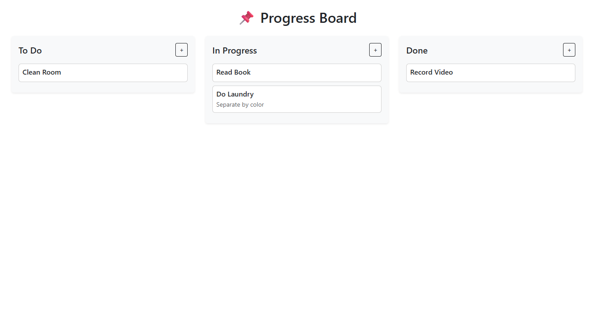
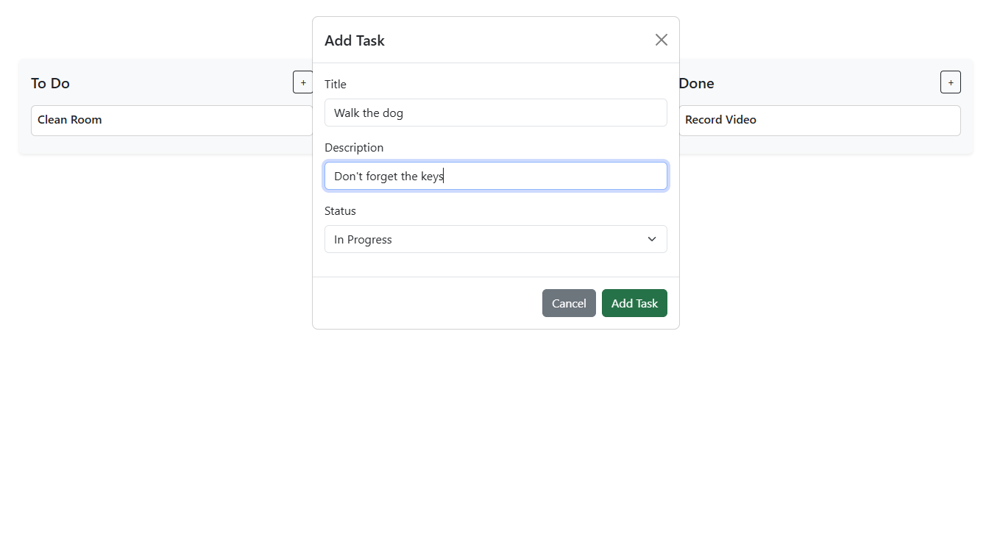
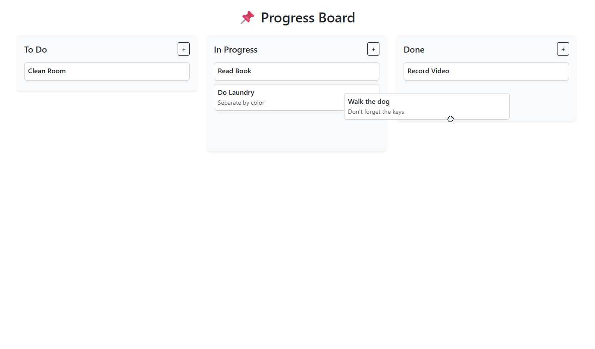
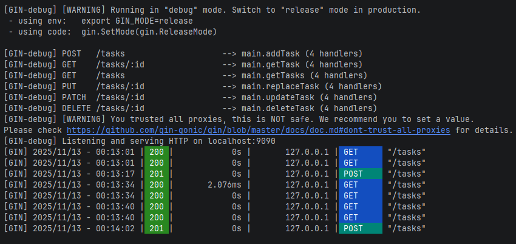

# Kanban Task Manager

Este projeto consiste em uma aplicação **full stack** para gerenciamento de tarefas em formato de **Kanban**.

## Como Executar

### Pré-requisitos

- [Go](https://golang.org/)
- [Node.js](https://nodejs.org/)

### 1. Clonar o repositório

```bash
git clone https://github.com/guilhermevazambuja/desafio-fullstack-veritas.git
cd seu-projeto
```

### 2. Instalar dependências do backend

```bash
cd backend
go mod tidy
```

### 3. Rodar o servidor

```bash
go run .
```

### 4. Em outro terminal, instalar dependências do frontend

```bash
cd frontend
npm i
```

### 5. Rodar o frontend

```bash
npm run dev
```

## Backend

- Desenvolvido em **Go** utilizando o framework **Gin**.
- Suporta os métodos HTTP **GET, POST, PUT, DELETE e PATCH**.
- As tarefas são armazenadas **em memória** durante a execução do servidor.
- O backend já está funcional, com pendências apenas em:
    - Validações adicionais de entrada.
    - Persistência dos dados em arquivos **JSON** (a ser implementada).

## Frontend

- Construído em **React** com **Vite**.
- Estrutura base dos componentes já implementada.
- A interface exibe um **Kanban com três colunas** (`To Do`, `In Progress`, `Done`).
- O usuário pode **arrastar e soltar** os cartões de tarefas entre colunas.
- Cada coluna possui um botão **"+"** que abre um formulário para criação de novas tarefas.
- As tarefas criadas são enviadas ao servidor Go via **Axios** e armazenadas no backend.
- Atualmente, apenas a funcionalidade de **criação de tarefas** possui interface amigável.  
  As demais operações (edição, exclusão, atualização de status) já existem no backend, mas ainda não possuem integração
  completa com a UI.

## API Endpoints

- `GET /tasks` – lista todas as tarefas
- `GET /tasks/:id` – retorna uma tarefa
- `POST /tasks` – cria uma nova tarefa
- `PUT /tasks/:id` – atualiza uma tarefa
- `DELETE /tasks/:id` – remove uma tarefa
- `PATCH /tasks/:id` – atualiza parcialmente uma tarefa

## Status do Projeto

- ✅ Backend funcional (com validações básicas e armazenamento em memória).
- ✅ Frontend inicial pronto (estrutura de componentes e Kanban interativo).
- ⚠️ Pendente: persistência em JSON e UI para todas as operações de tarefas.

## Screenshots

Abaixo estão algumas capturas de tela da aplicação em funcionamento:

### 1. Visualização do Kanban



### 2. Modal de criação de tarefa



### 3. Arrastar tarefa entre colunas



### 4. Servidor respondendo às requisições


